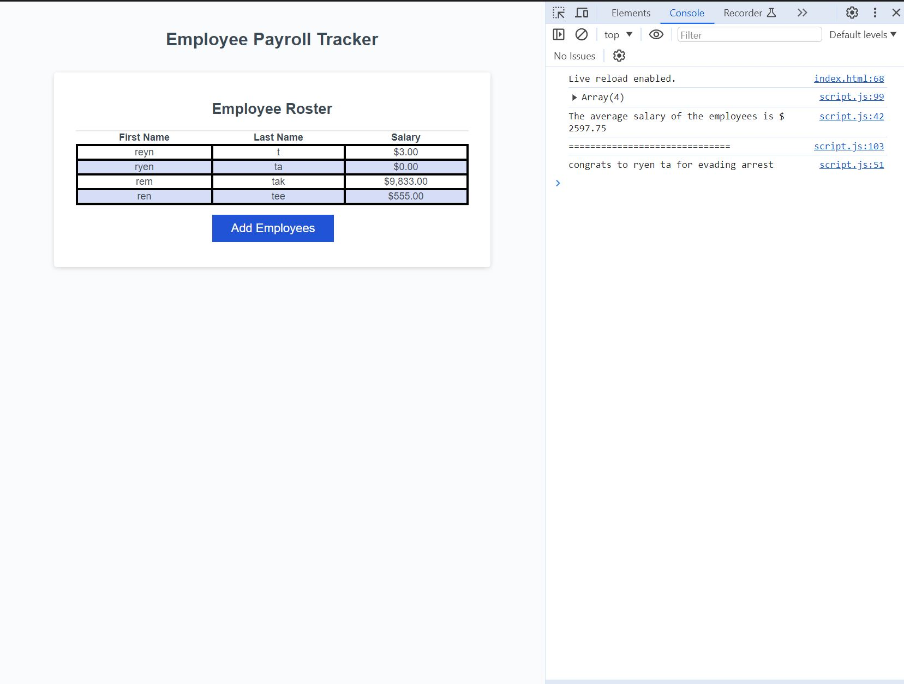

# Employee Payroll Tracker 

## Description
  The employee tracker was built to take inputs of employee names and salaries and enter them into a table. Once the user input data is entered in the prompts, the average salary is logged into the console.  There is also a feature that picks a random employee from the input data and logs an achievement into the console.  

## Installation
    N/A

## Usage
Upon use, the user is prompted to enter a fist name, last name, and salary.  The salary should be entered as a number.  Once all of the user data is entered, the user can cancel entering data in the prompts and the data appears in the table.  If you open the console you will see that the average salary of the entered employees will be logged as well as a random employees name and a reward they received.  

## License 
 Please see license in repository

 ## Credits

 Starter code was provided by the bootcamp

 ## Links
    Repository on github: https://github.com/RTAKA808/employee-payroll

live link: https://rtaka808.github.io/employee-payroll/